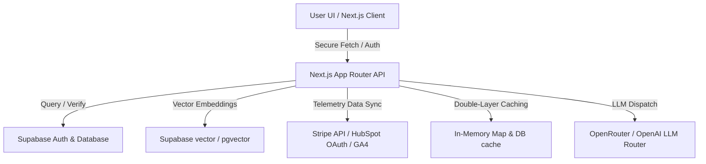

# 🚀 NovaPilot AI — Enterprise-Grade SaaS AI Assistant

NovaPilot AI is a production-ready, highly optimized SaaS prototype built with Next.js, Tailwind CSS, Supabase, and OpenAI/OpenRouter. It acts as an intelligent assistant that securely grounds AI responses using live telemetry synced from third-party enterprise integrations including **Stripe**, **HubSpot CRM**, and **Google Analytics 4 (GA4)**.

---

## 🏗️ System Architecture



---

## ✨ Features Implemented & Completed

We have built a fully persistent, high-fidelity SaaS application that goes far beyond a typical MVP:

### 1. 🔐 Multi-Tenant Workspace & Security
* **Tenant Isolation:** Enforced completely at the database level via Postgres Row Level Security (RLS) policies.
* **RBAC & Memberships:** Dynamic roles (`admin`, `team_member`) inside the `organizations` + `organization_members` tables.
* **Secure Auth Flow:** Fully integrated email/password, magic links, and Google OAuth callbacks.

### 2. ⚡ Double-Layer AI Caching System (Zero-Latency)
* **Tier 0 (Client Local Cache):** Caches questions locally in React state built from current thread history. Bypasses the network entirely on duplicate asks in a session—**rendering responses instantly in 0ms without showing any loading spinner**.
* **Tier 1 (Server-side Memory Cache):** Quick local in-memory Map cache on the server with a **1-hour TTL** to intercept requests before contacting DB or LLM.
* **Tier 2 (Server-side Database Cache):** Persists answers in the `ai_queries` table (fresh within **24 hours**) to withstand server restarts.
* **Quiet Syncing:** Background sync mechanism updates Postgres history and citations quietly without blocking user interactions.

### 3. 🔌 Third-Party Telemetry Integrations
* **Stripe Integration:** Active billing metrics (MRR, LTV, CAC) synced and logged, complete with webhook persistence.
* **HubSpot CRM Integration:** Full OAuth sync flow that pulls and matches active customer contacts, deals, and pipelines.
* **Google Analytics 4 (GA4):** Daily active users and anomaly detection parsed and stored for instant grounding.

### 4. 🗂️ Advanced Vector Retrieval (RAG)
* **Vector Ingestion:** Supports ingestion of text, PDFs, and documents, automatically split and vectorized into `pgvector` chunks.
* **Semantic Vector Search:** Searches knowledge bases to fetch hyper-relevant source context.
* **Citations & Trust Scores:** Every response dynamically outputs verified citations (e.g., `hubspot`, `stripe`) alongside confidence scores (`95% confidence`).

### 5. 💎 UI/UX Excellence
* **Beautiful Dashboard:** Clean sidebar, analytical tabs, and dark-mode compatible modern glassmorphism aesthetic.
* **Streaming typing effect:** Smooth server-to-client streaming route with proper metadata segmentation.
* **Smart UI States:** Handled error boundaries, dynamic empty states, and suggestion chips.

---

## 🛠️ Complete Task Completion Status

Here is the progress checklist of what has been developed and hardened:

- [x] **Phase 1:** Multi-tenant DB schema foundation, relationships, and Postgres RLS setup.
- [x] **Phase 2:** Authentication routes, callbacks, and autoprovisioning local workspaces.
- [x] **Phase 3:** High-fidelity dashboard shell, responsive workspace layouts, and protected routers.
- [x] **Phase 4:** Chat persistence baseline, threads database hooks, and streaming chat history.
- [x] **Phase 5:** Notifications schema and real-time UI synchronization.
- [x] **Phase 6:** Document upload, parsing record flows, and storage buckets setup.
- [x] **Phase 7:** Semantic retrieval system, pgvector integrations, and vector search modules.
- [x] **Phase 8:** Team admin views, membership invitations, and Stripe subscription schemas.
- [x] **Phase 9:** Analytics Dashboard driven directly from telemetry usage logs and sync engines.
- [x] **Phase 10:** Environmental hardening, secret keys separation, and dynamic LLM router.
- [x] **Caching Polish:** Multi-tiered Client + Server question caching allowing instant 0ms responses.

---

## 🚀 Local Setup Guide

### 1. Install Dependencies
```bash
npm install
```

### 2. Configure Environment variables
Create a `.env.local` file in the root directory:
```env
NEXT_PUBLIC_SUPABASE_URL=your_supabase_url
NEXT_PUBLIC_SUPABASE_ANON_KEY=your_supabase_anon_key
SUPABASE_SERVICE_ROLE_KEY=your_service_role_key

OPENAI_API_KEY=your_openai_or_openrouter_key
STRIPE_SECRET_KEY=your_stripe_secret_key
HUBSPOT_CLIENT_SECRET=your_hubspot_secret
```

### 3. Run Development Server
```bash
npm run dev
```
Open [http://localhost:3000](http://localhost:3000) to access NovaPilot AI.
